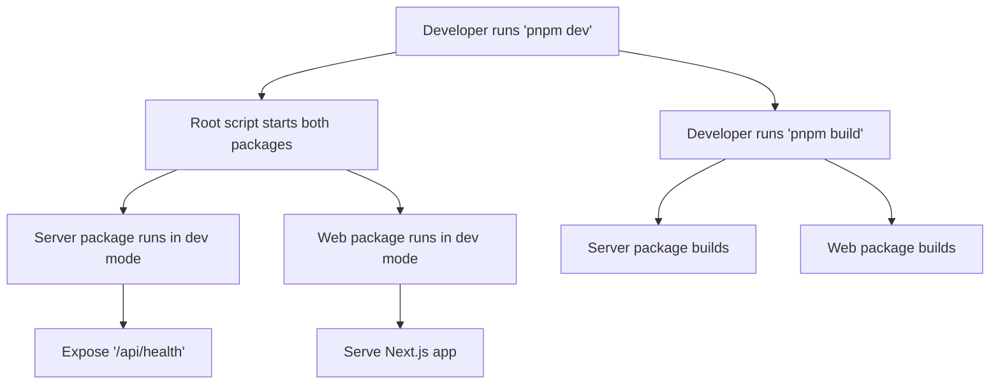

# Getting Started

<cite>
**Referenced Files in This Document**
- [README.md](file://README.md)
- [package.json](file://package.json)
- [pnpm-workspace.yaml](file://pnpm-workspace.yaml)
- [packages/server/package.json](file://packages/server/package.json)
- [packages/server/src/index.ts](file://packages/server/src/index.ts)
- [packages/web/package.json](file://packages/web/package.json)
- [packages/web/next.config.ts](file://packages/web/next.config.ts)
- [packages/web/next-env.d.ts](file://packages/web/next-env.d.ts)
</cite>

## Table of Contents
1. [Introduction](#introduction)
2. [Prerequisites](#prerequisites)
3. [Installation](#installation)
4. [Local Development Setup](#local-development-setup)
5. [Basic Usage](#basic-usage)
6. [Development Workflow](#development-workflow)
7. [Why the Web Package Appears Empty](#why-the-web-package-appears-empty)
8. [Extending the Frontend](#extending-the-frontend)
9. [Environment Configuration](#environment-configuration)
10. [Verification Steps](#verification-steps)
11. [Troubleshooting Guide](#troubleshooting-guide)
12. [Conclusion](#conclusion)

## Introduction
This guide helps you set up and run the Automaton Dashboard locally. The project is a pnpm workspace containing a backend server and a Next.js frontend. It provides a simple health check endpoint and a foundation to build dashboard features.

## Prerequisites
- Node.js: Install a stable LTS version compatible with the project’s dependencies.
- pnpm: Install pnpm globally to manage the workspace and package scripts.

These tools are required to install dependencies, run the development servers, and build the project.

**Section sources**
- [packages/server/package.json:9-26](file://packages/server/package.json#L9-L26)
- [packages/web/package.json:11-25](file://packages/web/package.json#L11-L25)

## Installation
Follow these steps to prepare your local environment:

1. Install dependencies for the entire workspace:
   - Run: pnpm install
   - This installs all dependencies defined in the workspace and package scripts.

2. Verify workspace configuration:
   - Confirm that pnpm recognizes the workspace packages via pnpm-workspace.yaml.

3. Build the project (optional):
   - Run: pnpm build
   - This builds both the server and web packages using their respective scripts.

Notes:
- The root package.json defines scripts to orchestrate building and development across packages.
- The workspace configuration ensures pnpm installs shared dependencies efficiently.

**Section sources**
- [package.json:5-12](file://package.json#L5-L12)
- [pnpm-workspace.yaml:1-3](file://pnpm-workspace.yaml#L1-L3)

## Local Development Setup
To develop both the server and web frontend concurrently:

1. Start the development servers:
   - Run: pnpm dev
   - This command starts:
     - The server package in development mode
     - The web package in development mode

2. Access the applications:
   - Server: http://localhost:4820 (default port)
   - Web: http://localhost:3000 (Next.js default)

3. Stop the servers:
   - Press Ctrl+C in the terminal to stop both servers.

How it works:
- The root script uses a concurrency utility to run both package scripts simultaneously.
- The server listens on the configured port and exposes a health endpoint.
- The web app runs Next.js in development mode.

**Section sources**
- [package.json:6-6](file://package.json#L6-L6)
- [packages/server/package.json:6-6](file://packages/server/package.json#L6-L6)
- [packages/web/package.json:6-6](file://packages/web/package.json#L6-L6)
- [packages/server/src/index.ts:17-19](file://packages/server/src/index.ts#L17-L19)

## Basic Usage
After starting the development servers:

1. Health check:
   - Open: http://localhost:4820/api/health
   - Expected response: a JSON object indicating the service is healthy.

2. Web interface:
   - Open: http://localhost:3000
   - The Next.js app initializes but currently renders no pages until you add routes and components.

3. Build for production (optional):
   - Run: pnpm build
   - Generates optimized artifacts for both server and web.

**Section sources**
- [packages/server/src/index.ts:13-15](file://packages/server/src/index.ts#L13-L15)
- [package.json:7-7](file://package.json#L7-L7)

## Development Workflow
The project follows a simple workflow:

- Workspace management: pnpm manages dependencies and scripts across packages.
- Concurrent development: The root dev script runs both server and web in parallel.
- Build pipeline: Each package has its own build script tailored to its runtime.

**Diagram sources**
- [package.json:6-7](file://package.json#L6-L7)
- [packages/server/package.json:6-7](file://packages/server/package.json#L6-L7)
- [packages/web/package.json:6-8](file://packages/web/package.json#L6-L8)

**Section sources**
- [package.json:5-12](file://package.json#L5-L12)
- [packages/server/package.json:5-26](file://packages/server/package.json#L5-L26)
- [packages/web/package.json:5-27](file://packages/web/package.json#L5-L27)

## Why the Web Package Appears Empty
The web package currently has minimal configuration and no pages directory. This is expected in early-stage projects. The Next.js app initializes because the required configuration files exist, but no routes are defined yet.

What exists:
- Next.js configuration file
- Environment declaration file
- Dependencies for Next.js, React, and related types

What is missing:
- Pages or app directory with route handlers
- Custom pages or components

Next steps:
- Add a pages directory with index.tsx or use the new app directory pattern.
- Create your first page and integrate with the backend.

**Section sources**
- [packages/web/next.config.ts:1-8](file://packages/web/next.config.ts#L1-L8)
- [packages/web/next-env.d.ts:1-7](file://packages/web/next-env.d.ts#L1-L7)
- [packages/web/package.json:11-25](file://packages/web/package.json#L11-L25)

## Extending the Frontend
To begin adding the frontend:

1. Create a pages directory under the web package and add an index page.
2. Import and render basic UI components.
3. Connect to the backend:
   - Fetch data from the server endpoint exposed by the backend.
   - Use the Next.js fetch API or a client-side library to communicate with the backend.
4. Add Tailwind CSS utilities if desired (already included as a dev dependency).
5. Run the development server to preview changes.

Tips:
- Keep the frontend responsive and modular.
- Use TypeScript for type safety.
- Leverage Next.js features like dynamic routes and API routes as needed.

[No sources needed since this section provides general guidance]

## Environment Configuration
The server loads environment variables using a configuration utility. To configure the server:

1. Create a .env file at the root of the server package.
2. Define environment variables such as the server port.
3. The server reads the .env file during startup.

Verification:
- Confirm the server logs show the port it is listening on after starting the dev server.

**Section sources**
- [packages/server/src/index.ts:5-5](file://packages/server/src/index.ts#L5-L5)
- [packages/server/src/index.ts:8-8](file://packages/server/src/index.ts#L8-L8)
- [packages/server/src/index.ts:17-19](file://packages/server/src/index.ts#L17-L19)

## Verification Steps
Confirm your installation and setup:

1. Install dependencies:
   - Run: pnpm install
   - Ensure no errors occur during installation.

2. Start development servers:
   - Run: pnpm dev
   - Verify both servers start without errors.

3. Health check:
   - Visit: http://localhost:4820/api/health
   - Expect a successful JSON response indicating the service is healthy.

4. Web app:
   - Visit: http://localhost:3000
   - Expect the Next.js development server to serve the app.

5. Build verification:
   - Run: pnpm build
   - Ensure both server and web build successfully.

**Section sources**
- [package.json:6-7](file://package.json#L6-L7)
- [packages/server/src/index.ts:13-15](file://packages/server/src/index.ts#L13-L15)
- [packages/server/src/index.ts:17-19](file://packages/server/src/index.ts#L17-L19)

## Troubleshooting Guide
Common issues and resolutions:

- Port conflicts:
  - Symptom: Server fails to start or logs indicate port already in use.
  - Resolution: Change the port in the environment configuration or stop the conflicting process.

- Missing dependencies:
  - Symptom: Errors during install or dev start.
  - Resolution: Re-run the installation command to ensure all workspace dependencies are installed.

- pnpm workspace not recognized:
  - Symptom: Scripts fail to target packages.
  - Resolution: Verify the workspace configuration and ensure pnpm is installed and up to date.

- Web app blank page:
  - Symptom: Next.js serves the app but shows no content.
  - Resolution: Add a pages directory with an index page or configure the app directory with a root route.

- CORS issues:
  - Symptom: Browser blocks requests from the frontend to the backend.
  - Resolution: Confirm the server enables CORS middleware and that the frontend makes requests from the correct origin.

**Section sources**
- [packages/server/src/index.ts:10-10](file://packages/server/src/index.ts#L10-L10)
- [packages/server/src/index.ts:17-19](file://packages/server/src/index.ts#L17-L19)
- [packages/web/package.json:11-25](file://packages/web/package.json#L11-L25)

## Conclusion
You now have the Automaton Dashboard running locally with both the server and web development servers active. The server exposes a health check endpoint, and the web app initializes. Extend the frontend by adding pages and integrating with the backend. Use the provided scripts to streamline development and build processes.

[No sources needed since this section summarizes without analyzing specific files]