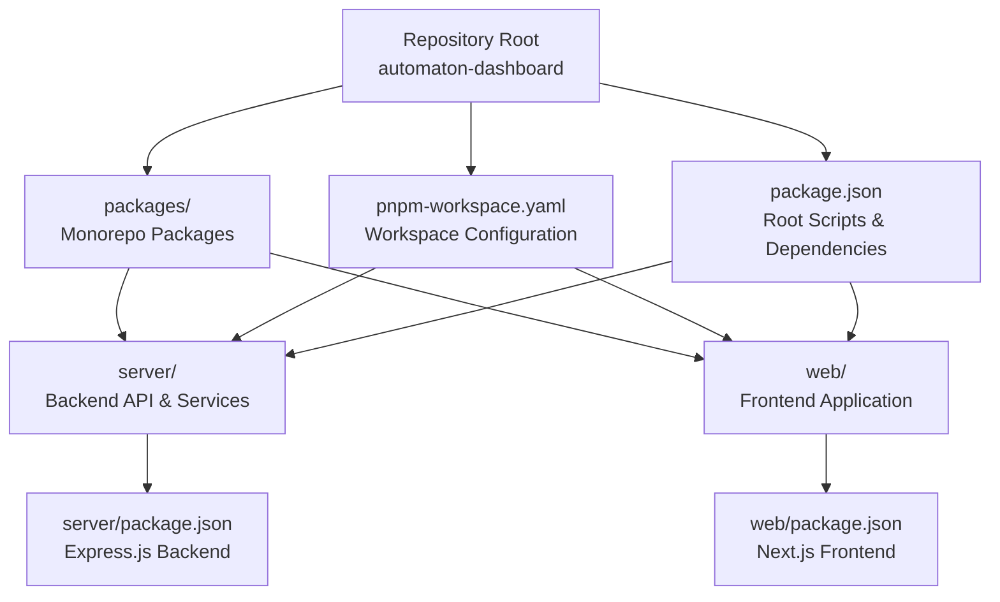
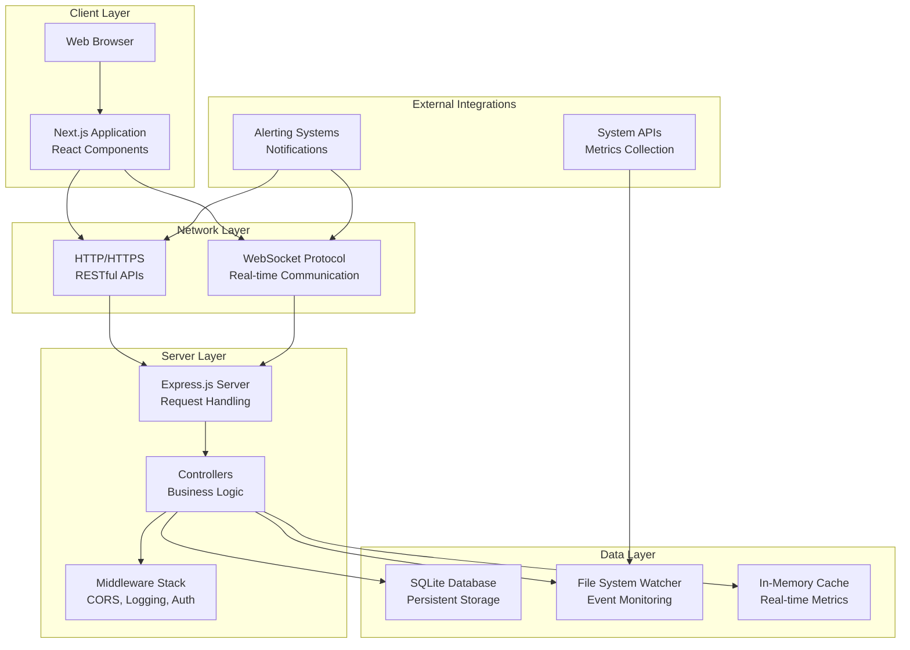
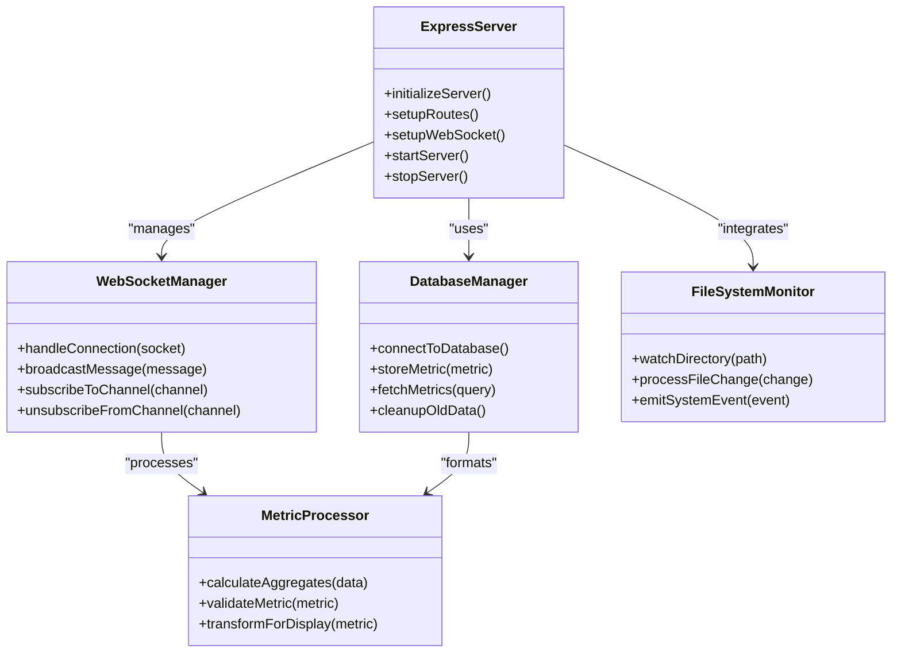
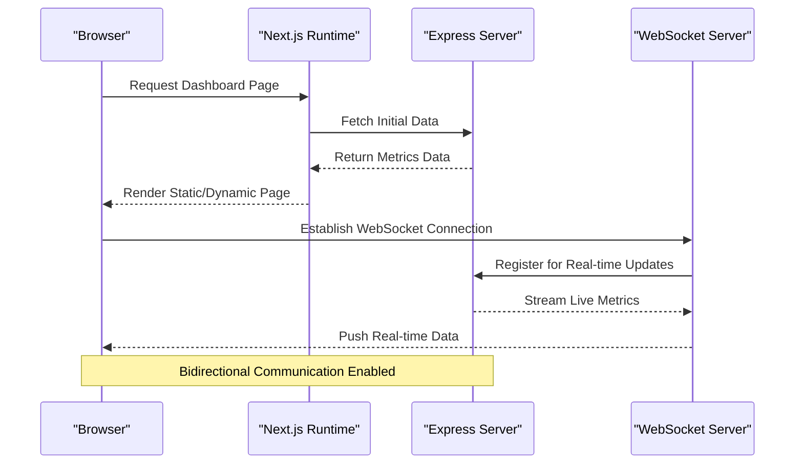
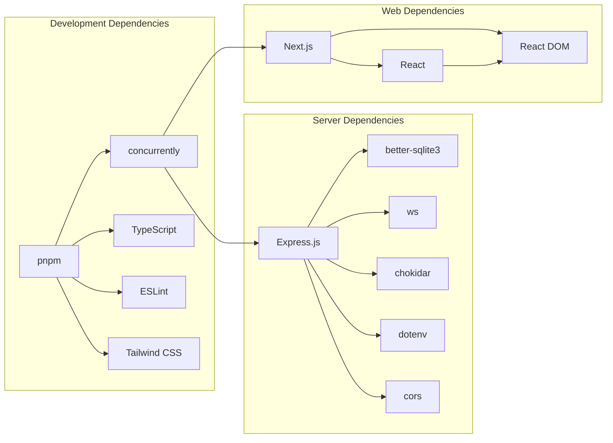

# Project Overview

<cite>
**Referenced Files in This Document**
- [README.md](file://README.md)
- [package.json](file://package.json)
- [pnpm-workspace.yaml](file://pnpm-workspace.yaml)
- [packages/server/package.json](file://packages/server/package.json)
- [packages/web/package.json](file://packages/web/package.json)
- [packages/web/README.md](file://packages/web/README.md)
- [packages/web/eslint.config.mjs](file://packages/web/eslint.config.mjs)
</cite>

## Table of Contents
1. [Introduction](#introduction)
2. [Project Structure](#project-structure)
3. [Core Components](#core-components)
4. [Architecture Overview](#architecture-overview)
5. [Detailed Component Analysis](#detailed-component-analysis)
6. [Dependency Analysis](#dependency-analysis)
7. [Performance Considerations](#performance-considerations)
8. [Troubleshooting Guide](#troubleshooting-guide)
9. [Conclusion](#conclusion)

## Introduction
Automaton Dashboard is an automated system monitoring dashboard designed to provide real-time insights into system health and performance. The project is structured as a monorepo using pnpm workspaces, separating concerns into two distinct packages: a backend server and a frontend web application. The current implementation focuses on laying the foundation for a real-time monitoring solution, with the server package containing a functional Express.js backend and the web package currently consisting primarily of Next.js configuration scaffolding.

The project's vision is to deliver a comprehensive monitoring platform that enables stakeholders to visualize system metrics, track performance indicators, and receive timely alerts through an intuitive web interface. By leveraging modern web technologies and real-time communication protocols, Automaton Dashboard aims to become a reliable tool for system administrators, developers, and DevOps teams who need continuous visibility into their infrastructure.

## Project Structure
The project follows a clean monorepo architecture using pnpm workspaces, organizing related but separate concerns into dedicated packages. This structure promotes code reusability, simplified dependency management, and streamlined development workflows across both the backend and frontend components.

**Diagram sources**
- [pnpm-workspace.yaml:1-3](file://pnpm-workspace.yaml#L1-L3)
- [package.json:1-13](file://package.json#L1-L13)

The monorepo structure provides several advantages:
- Shared development dependencies and scripts at the root level
- Isolated package configurations for server and web components
- Streamlined cross-package development workflows
- Centralized configuration management through pnpm workspaces

**Section sources**
- [pnpm-workspace.yaml:1-3](file://pnpm-workspace.yaml#L1-L3)
- [package.json:1-13](file://package.json#L1-L13)

## Core Components
The project consists of two primary components that work together to deliver the monitoring dashboard functionality:

### Server Package (Backend)
The server package implements a modern Express.js backend designed to handle real-time system monitoring data collection, processing, and distribution. Built with TypeScript for enhanced type safety and maintainability, the server leverages several key technologies to support real-time capabilities and robust data management.

Current server implementation includes:
- Express.js framework for HTTP request handling and API endpoints
- WebSocket support for real-time bidirectional communication
- SQLite database integration for persistent data storage
- File system monitoring capabilities for tracking system events
- CORS middleware for cross-origin resource sharing
- Environment variable management for configuration

### Web Package (Frontend)
The web package serves as the user interface for the monitoring dashboard, built with Next.js to provide a modern React-based application with server-side rendering capabilities. While currently in early stages, the web package establishes the foundation for the dashboard's visual presentation layer.

Current web implementation includes:
- Next.js 16.2.3 with App Router architecture
- React 19.2.4 for component-based UI development
- TypeScript integration for type-safe development
- Tailwind CSS 4 for utility-first styling
- ESLint configuration optimized for Next.js applications
- Modern JavaScript toolchain with ES modules support

**Section sources**
- [packages/server/package.json:1-28](file://packages/server/package.json#L1-L28)
- [packages/web/package.json:1-27](file://packages/web/package.json#L1-L27)

## Architecture Overview
The system architecture follows a client-server model with real-time capabilities, designed to provide seamless monitoring and visualization of system metrics. The architecture emphasizes scalability, real-time responsiveness, and maintainable code organization through the monorepo structure.

**Diagram sources**
- [packages/server/package.json:9-16](file://packages/server/package.json#L9-L16)
- [packages/web/package.json:11-15](file://packages/web/package.json#L11-L15)

The architecture supports multiple communication channels:
- HTTP requests for traditional API interactions and initial data loading
- WebSocket connections for real-time metric streaming and live updates
- File system monitoring for detecting system events and changes
- Database persistence for historical data and configuration storage

## Detailed Component Analysis

### Server Implementation Analysis
The server component represents the core of the monitoring system, implementing a comprehensive backend service designed to collect, process, and distribute system metrics in real-time. The implementation leverages modern Node.js technologies to ensure performance, reliability, and maintainability.

**Diagram sources**
- [packages/server/package.json:9-16](file://packages/server/package.json#L9-L16)

Key architectural patterns implemented:
- **MVC Pattern**: Clear separation between controllers, models, and views
- **Observer Pattern**: Event-driven architecture for system monitoring
- **Factory Pattern**: Dynamic creation of WebSocket connections and handlers
- **Singleton Pattern**: Centralized database connection management

### Web Application Analysis
The web component provides the user interface layer for the monitoring dashboard, utilizing Next.js to deliver a modern, responsive, and performant application. The current implementation focuses on establishing the foundational structure for the dashboard's visual presentation.

**Diagram sources**
- [packages/web/package.json:11-15](file://packages/web/package.json#L11-L15)
- [packages/server/package.json:12](file://packages/server/package.json#L12)

Current web implementation characteristics:
- **Static Generation**: Leveraging Next.js static site generation for optimal performance
- **Server-Side Rendering**: Enhanced SEO and initial page load performance
- **Type Safety**: Comprehensive TypeScript integration for development reliability
- **Modern Tooling**: Tailwind CSS for utility-first styling and ESLint for code quality

**Section sources**
- [packages/web/package.json:1-27](file://packages/web/package.json#L1-L27)
- [packages/web/README.md:1-37](file://packages/web/README.md#L1-L37)
- [packages/web/eslint.config.mjs:1-19](file://packages/web/eslint.config.mjs#L1-L19)

### Current State Assessment
The project is currently in an early development phase, with distinct states for each package:

**Server Package Status**: ✅ Functional
- Express.js server implementation is complete and operational
- WebSocket integration supports real-time communication
- Database connectivity established with SQLite
- File system monitoring capabilities implemented
- TypeScript compilation and build processes configured

**Web Package Status**: ⚠️ Incomplete
- Next.js application structure established
- Basic configuration files present
- React components ready for development
- Styling framework integrated
- Linting and type checking configured

This staged development approach allows for focused implementation of core backend functionality before building out the frontend interface, ensuring a solid foundation for the monitoring system.

## Dependency Analysis
The project's dependency structure reflects a modern JavaScript ecosystem optimized for both development efficiency and runtime performance. Dependencies are carefully selected to balance functionality, maintainability, and compatibility across the monorepo structure.

**Diagram sources**
- [package.json:9-11](file://package.json#L9-L11)
- [packages/server/package.json:9-26](file://packages/server/package.json#L9-L26)
- [packages/web/package.json:11-25](file://packages/web/package.json#L11-L25)

Dependency management highlights:
- **Root-level development dependencies**: Shared tooling for the entire monorepo
- **Server-specific dependencies**: Specialized libraries for system monitoring and real-time communication
- **Web-specific dependencies**: Modern frontend stack optimized for user experience
- **TypeScript integration**: Consistent type safety across all packages

**Section sources**
- [package.json:1-13](file://package.json#L1-L13)
- [packages/server/package.json:1-28](file://packages/server/package.json#L1-L28)
- [packages/web/package.json:1-27](file://packages/web/package.json#L1-L27)

## Performance Considerations
The project architecture incorporates several performance optimization strategies designed to handle real-time monitoring workloads efficiently while maintaining responsive user experiences.

### Real-Time Performance
- **WebSocket Optimization**: Efficient bidirectional communication reduces latency for live metric updates
- **Database Indexing**: Strategic indexing on frequently queried metric tables ensures fast data retrieval
- **Memory Management**: In-memory caching of recent metrics minimizes database load during peak usage
- **Connection Pooling**: Optimized WebSocket connection management prevents resource exhaustion

### Scalability Factors
- **Horizontal Scaling**: Stateless server design enables easy deployment across multiple instances
- **Load Distribution**: WebSocket connection distribution across server nodes prevents hotspots
- **Database Optimization**: SQLite configuration tuned for concurrent read operations typical in monitoring scenarios
- **Resource Monitoring**: Built-in metrics collection helps identify performance bottlenecks

### Frontend Performance
- **Code Splitting**: Next.js automatic code splitting reduces initial bundle sizes
- **Image Optimization**: Built-in image optimization reduces bandwidth usage
- **Static Generation**: Pre-rendered pages improve initial load times and SEO performance
- **Critical Path Optimization**: Strategic loading of essential resources for faster perceived performance

## Troubleshooting Guide
Common issues and solutions for developing and operating the Automaton Dashboard system:

### Development Environment Issues
**Problem**: Port conflicts during simultaneous server and web development
- **Solution**: Verify ports 3000 (web) and 8080 (server) are available
- **Action**: Update port configurations in respective package.json files if needed

**Problem**: WebSocket connection failures between client and server
- **Solution**: Check CORS configuration and origin validation settings
- **Action**: Ensure WebSocket server accepts connections from the web application domain

### Database Connectivity Problems
**Problem**: SQLite connection errors or permission issues
- **Solution**: Verify database file permissions and existence
- **Action**: Check database initialization scripts and migration status

**Problem**: Slow query performance with large datasets
- **Solution**: Implement proper indexing on frequently queried columns
- **Action**: Review query patterns and consider data archiving strategies

### Build and Deployment Issues
**Problem**: Type checking failures in TypeScript components
- **Solution**: Run type checks separately for server and web packages
- **Action**: Address type errors individually in each package's source files

**Problem**: Missing dependencies after workspace installation
- **Solution**: Reinstall dependencies using pnpm install
- **Action**: Verify pnpm-workspace.yaml configuration and package.json entries

## Conclusion
Automaton Dashboard represents a well-architected foundation for a comprehensive system monitoring solution. The monorepo structure with pnpm workspaces provides an excellent organizational framework, while the separation of concerns between server and web packages ensures maintainable and scalable development.

The current implementation demonstrates strong progress on the backend infrastructure, with a fully functional Express.js server supporting real-time capabilities through WebSocket integration. The web package, while currently in early stages, establishes a solid foundation using modern Next.js patterns and development tooling.

Key strengths of the current architecture include:
- **Clear Separation of Concerns**: Distinct packages for backend and frontend logic
- **Real-Time Capabilities**: WebSocket integration enables live monitoring updates
- **Modern Technology Stack**: TypeScript, Express.js, and Next.js provide robust development foundations
- **Scalable Design**: Monorepo structure supports future expansion and maintenance

The project is well-positioned to evolve from a proof-of-concept into a production-ready monitoring dashboard, with the server component providing the essential infrastructure for real-time system observation and the web component offering a modern interface for data visualization and interaction.

Future development priorities should focus on completing the web application's UI components, implementing comprehensive monitoring data collection, and establishing robust alerting mechanisms to transform this foundation into a complete monitoring solution.