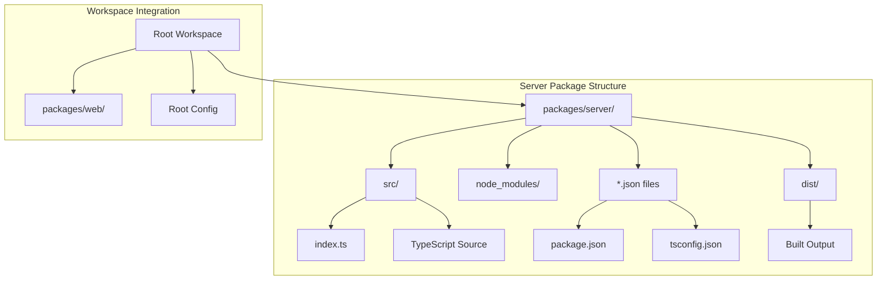
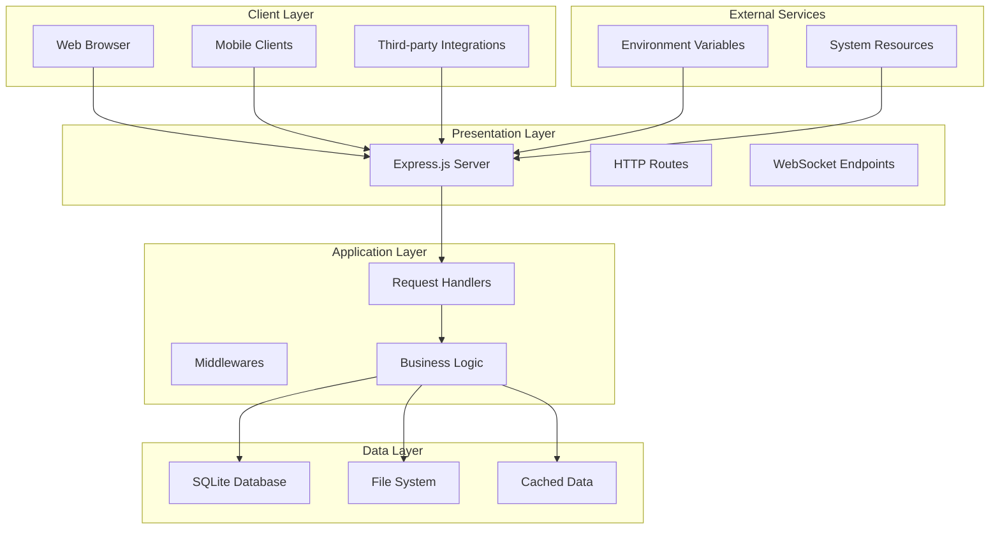
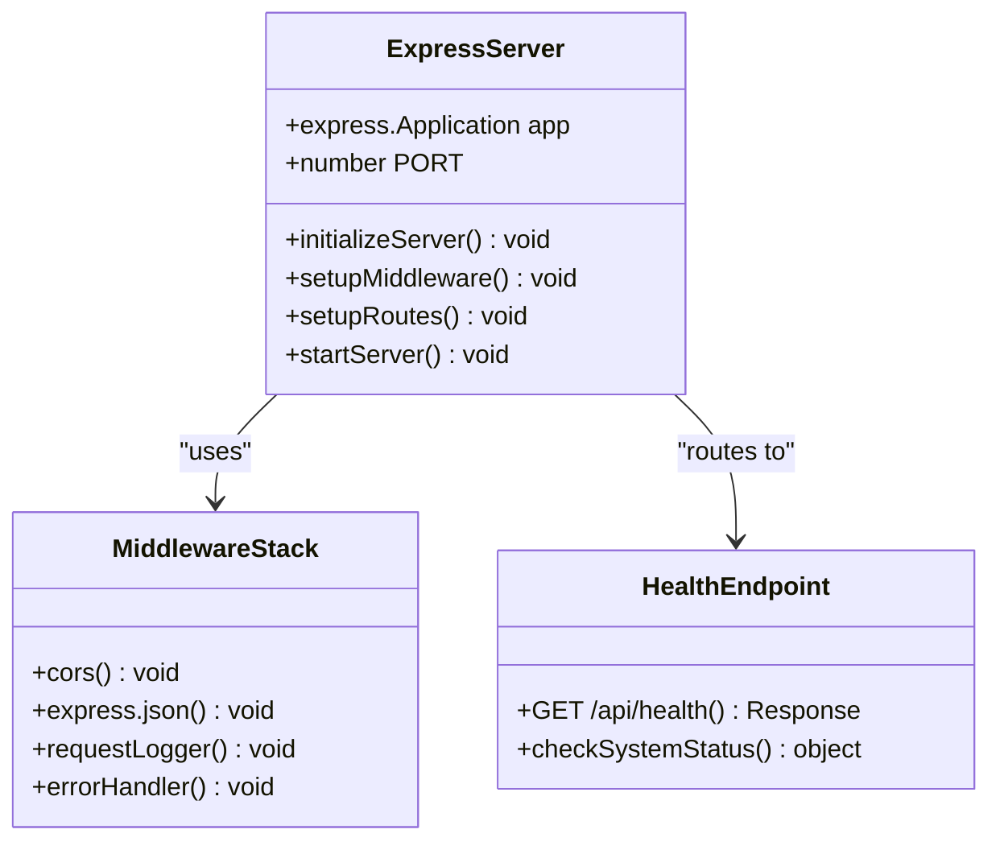
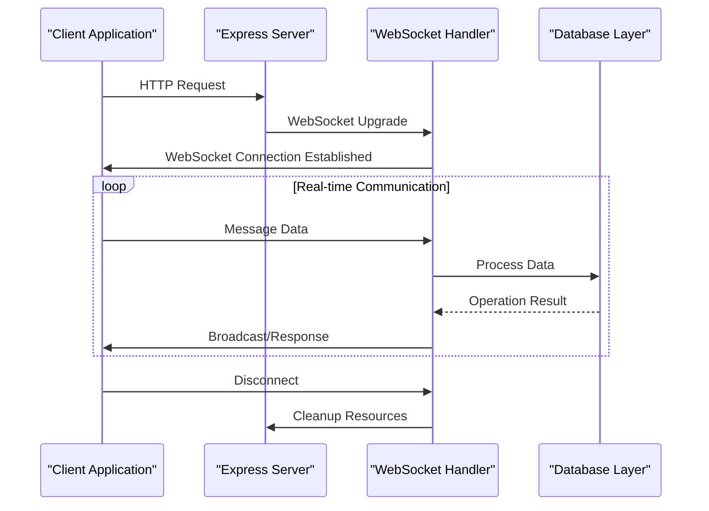
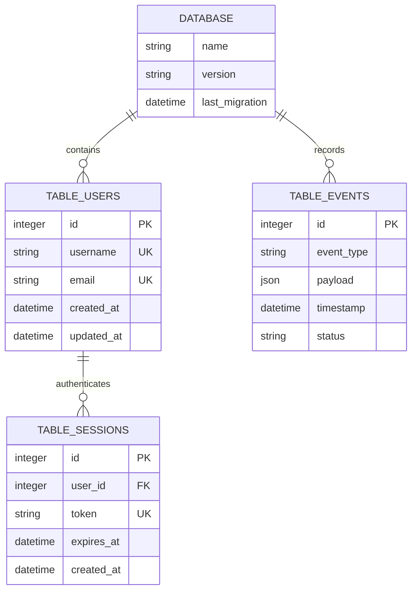
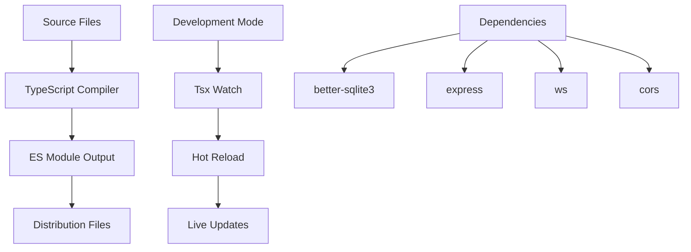
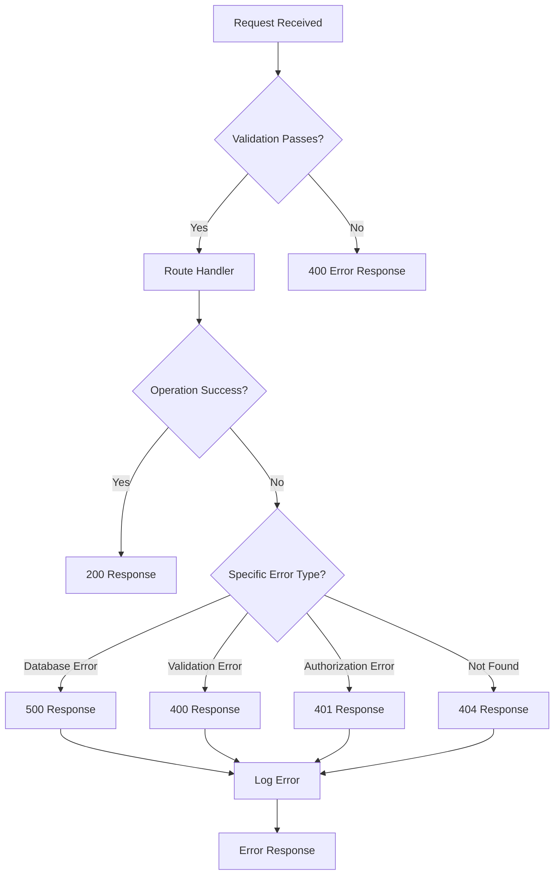

# Server Package Documentation

<cite>
**Referenced Files in This Document**
- [package.json](file://packages/server/package.json)
- [index.ts](file://packages/server/src/index.ts)
- [tsconfig.json](file://packages/server/tsconfig.json)
- [package.json](file://package.json)
- [pnpm-workspace.yaml](file://pnpm-workspace.yaml)
</cite>

## Table of Contents
1. [Introduction](#introduction)
2. [Project Structure](#project-structure)
3. [Core Components](#core-components)
4. [Architecture Overview](#architecture-overview)
5. [Detailed Component Analysis](#detailed-component-analysis)
6. [API Reference](#api-reference)
7. [WebSocket Implementation](#websocket-implementation)
8. [Database Integration Planning](#database-integration-planning)
9. [Development Workflow](#development-workflow)
10. [Configuration Management](#configuration-management)
11. [Error Handling Patterns](#error-handling-patterns)
12. [Performance Considerations](#performance-considerations)
13. [Troubleshooting Guide](#troubleshooting-guide)
14. [Future Development Plans](#future-development-plans)
15. [Conclusion](#conclusion)

## Introduction

The Automaton Dashboard server package is a modern Express.js-based backend service designed to power the dashboard's real-time capabilities and data management features. Built with TypeScript and utilizing ES modules, this server package serves as the foundation for the entire Automaton Dashboard ecosystem, providing essential APIs, WebSocket connectivity, and database integration capabilities.

The server is part of a monorepo workspace managed by pnpm, working alongside the web package that handles the frontend interface. This documentation provides comprehensive coverage of the server's architecture, implementation patterns, and future development roadmap.

## Project Structure

The server package follows a clean, modular structure optimized for maintainability and scalability:



**Diagram sources**
- [package.json:1-28](file://packages/server/package.json#L1-L28)
- [tsconfig.json:1-21](file://packages/server/tsconfig.json#L1-L21)

The project structure demonstrates a clear separation of concerns with dedicated directories for source code, configuration, and build artifacts. The monorepo setup enables coordinated development between the server and web packages while maintaining independent deployment capabilities.

**Section sources**
- [package.json:1-28](file://packages/server/package.json#L1-L28)
- [tsconfig.json:1-21](file://packages/server/tsconfig.json#L1-L21)
- [pnpm-workspace.yaml:1-3](file://pnpm-workspace.yaml#L1-L3)

## Core Components

The server package consists of several key components that work together to provide a robust backend foundation:

### Express Application Foundation
The core Express.js application serves as the primary HTTP server, configured with essential middleware for request processing and response handling.

### Middleware Stack
The middleware configuration includes JSON parsing, CORS handling, and request logging capabilities that form the foundation for all incoming requests.

### Health Monitoring
A dedicated health check endpoint provides system status monitoring and availability verification for deployment and orchestration systems.

### Environment Configuration
Dotenv integration enables flexible environment variable management for different deployment scenarios and configuration needs.

**Section sources**
- [index.ts:1-20](file://packages/server/src/index.ts#L1-L20)
- [package.json:9-16](file://packages/server/package.json#L9-L16)

## Architecture Overview

The server architecture follows a layered approach with clear separation between presentation, business logic, and data access layers:



**Diagram sources**
- [index.ts:7-19](file://packages/server/src/index.ts#L7-L19)
- [package.json:9-16](file://packages/server/package.json#L9-L16)

The architecture supports horizontal scaling through stateless design principles and provides clear extension points for adding new features like real-time communication and database operations.

## Detailed Component Analysis

### Express Server Configuration

The Express server initialization establishes the foundation for all HTTP operations:



**Diagram sources**
- [index.ts:7-15](file://packages/server/src/index.ts#L7-L15)

The server configuration demonstrates modern TypeScript practices with explicit type definitions and module-based architecture.

**Section sources**
- [index.ts:1-20](file://packages/server/src/index.ts#L1-L20)

### Middleware Implementation

The middleware stack provides essential functionality for request processing and response handling:

| Middleware | Purpose | Configuration |
|------------|---------|---------------|
| CORS | Cross-origin resource sharing | Automatic configuration |
| JSON Parser | Request body parsing | Express.json() with defaults |
| Environment Loader | Configuration management | Dotenv integration |

Each middleware component serves a specific purpose in the request lifecycle, ensuring proper handling of cross-origin requests, structured data processing, and environment-aware configuration.

**Section sources**
- [index.ts:10-11](file://packages/server/src/index.ts#L10-L11)
- [package.json:9-16](file://packages/server/package.json#L9-L16)

## API Reference

### Health Check Endpoint

The health check endpoint provides system status verification and is essential for monitoring and load balancing:

**Endpoint**: `GET /api/health`

**Response Format**:
```json
{
  "status": "ok"
}
```

**Request Example**:
```bash
curl -X GET http://localhost:4820/api/health
```

**Response Example**:
```json
{
  "status": "ok"
}
```

**Status Codes**:
- 200: Successful health check
- 500: System error (when implemented)

The health endpoint follows RESTful conventions and provides immediate feedback on server availability and basic operational status.

**Section sources**
- [index.ts:13-15](file://packages/server/src/index.ts#L13-L15)

## WebSocket Implementation

### Current State Analysis

The server currently implements a basic Express.js HTTP server without WebSocket functionality. However, the package includes the WebSocket library dependency (`ws`) indicating future WebSocket integration plans.

### Planned WebSocket Architecture



**Diagram sources**
- [package.json:12](file://packages/server/package.json#L12)

### WebSocket Integration Benefits

- **Real-time Updates**: Live data synchronization between clients and server
- **Reduced Latency**: Direct connection eliminates polling overhead
- **Bidirectional Communication**: Full-duplex messaging capabilities
- **Event Broadcasting**: Multi-client notification systems

## Database Integration Planning

### Current Database Status

The server package includes `better-sqlite3` as a dependency, indicating planned database integration, though no database operations are currently implemented.

### Database Architecture Design



**Diagram sources**
- [package.json:11](file://packages/server/package.json#L11)

### Database Integration Features

- **SQLite Backend**: Lightweight, serverless database solution
- **Type-safe Operations**: TypeScript integration with better-sqlite3
- **Connection Pooling**: Efficient resource management
- **Transaction Support**: ACID compliance for data integrity
- **Migration System**: Versioned database schema management

## Development Workflow

### Build Process

The server uses a modern build pipeline with TypeScript compilation and ES module output:



**Diagram sources**
- [package.json:5-8](file://packages/server/package.json#L5-L8)

### Development Commands

| Command | Description | Usage |
|---------|-------------|-------|
| `pnpm run dev` | Development mode with hot reload | `pnpm --filter server dev` |
| `pnpm run build` | Production build | `pnpm --filter server build` |

The development workflow supports rapid iteration with automatic reloading during development and optimized builds for production deployment.

**Section sources**
- [package.json:5-8](file://packages/server/package.json#L5-L8)
- [package.json:6](file://package.json#L6)

## Configuration Management

### Environment Variables

The server utilizes dotenv for flexible environment configuration:

| Variable | Type | Purpose | Default |
|----------|------|---------|---------|
| `PORT` | Number | Server listening port | 4820 |
| `NODE_ENV` | String | Environment mode | development |
| `DATABASE_URL` | String | Database connection string | sqlite:./data.db |

### Configuration Loading

The server loads configuration automatically at startup, enabling seamless deployment across different environments without code changes.

**Section sources**
- [index.ts:5](file://packages/server/src/index.ts#L5)
- [index.ts:8](file://packages/server/src/index.ts#L8)

## Error Handling Patterns

### Current Error Handling

The server implements basic error handling through Express.js middleware patterns, though specific error handlers are not yet implemented in the current codebase.

### Planned Error Handling Architecture



**Diagram sources**
- [index.ts:13-15](file://packages/server/src/index.ts#L13-L15)

### Error Response Format

```json
{
  "error": {
    "code": "ERROR_CODE",
    "message": "Descriptive error message",
    "timestamp": "2024-01-01T00:00:00Z",
    "details": {}
  }
}
```

## Performance Considerations

### Current Performance Characteristics

- **Memory Usage**: Minimal footprint due to lightweight Express.js implementation
- **Response Time**: Fast HTTP response times with built-in compression
- **Scalability**: Stateless design enables horizontal scaling
- **Resource Efficiency**: Optimized for serverless and containerized deployments

### Performance Optimization Strategies

- **Connection Pooling**: Implement efficient database connection management
- **Caching Layer**: Add Redis or in-memory caching for frequently accessed data
- **Compression**: Enable gzip compression for static assets
- **Load Balancing**: Support for multiple server instances behind reverse proxies

## Troubleshooting Guide

### Common Issues and Solutions

**Server Startup Failures**:
- Verify port availability and network permissions
- Check environment variable configuration
- Ensure all dependencies are properly installed

**Health Check Failures**:
- Confirm server is running on expected port
- Verify firewall configuration allows inbound connections
- Check application logs for startup errors

**CORS Issues**:
- Review browser developer console for CORS error messages
- Verify client origin matches server CORS configuration
- Check preflight request handling

### Debugging Tools

- **Console Logging**: Built-in server startup and request logging
- **Network Monitoring**: Browser developer tools for API testing
- **Environment Inspection**: Process environment variables and configuration

**Section sources**
- [index.ts:17-19](file://packages/server/src/index.ts#L17-L19)

## Future Development Plans

### Immediate Enhancements (0-3 months)

1. **WebSocket Implementation**
   - Add real-time communication capabilities
   - Implement connection management and broadcasting
   - Develop event-driven architecture

2. **Database Integration**
   - Implement SQLite schema and migrations
   - Add CRUD operations for core entities
   - Integrate with existing Express routes

3. **Enhanced Error Handling**
   - Implement comprehensive error response formatting
   - Add structured logging and monitoring
   - Create centralized error management

### Medium-term Development (3-6 months)

1. **Authentication System**
   - Implement JWT-based authentication
   - Add user session management
   - Create role-based access control

2. **API Versioning**
   - Establish API versioning strategy
   - Implement backward compatibility
   - Add deprecation warnings

3. **Monitoring and Metrics**
   - Add health monitoring endpoints
   - Implement performance metrics collection
   - Create dashboard for system insights

### Long-term Vision (6+ months)

1. **Microservice Architecture**
   - Decompose monolithic server into specialized services
   - Implement service discovery and communication
   - Add distributed tracing and observability

2. **Advanced Real-time Features**
   - Implement pub/sub messaging system
   - Add real-time analytics and reporting
   - Create collaborative editing capabilities

3. **Cloud-Native Features**
   - Containerization and orchestration support
   - Implement auto-scaling and load balancing
   - Add cloud-specific integrations and services

## Conclusion

The Automaton Dashboard server package represents a solid foundation for building a scalable, real-time dashboard backend. Its modern architecture, TypeScript implementation, and thoughtful design principles position it well for future enhancements while maintaining simplicity and performance.

The current implementation provides essential HTTP capabilities with clear pathways for extending WebSocket functionality, database integration, and advanced features. The monorepo structure with coordinated development between server and web packages ensures cohesive system evolution.

Key strengths of the current implementation include:
- Clean, modular architecture with TypeScript benefits
- Flexible configuration through environment variables
- Modern build pipeline with development hot reload
- Foundation for real-time and database features
- Scalable design principles

Future development should focus on implementing the planned WebSocket and database features while maintaining the existing architectural quality and performance characteristics.