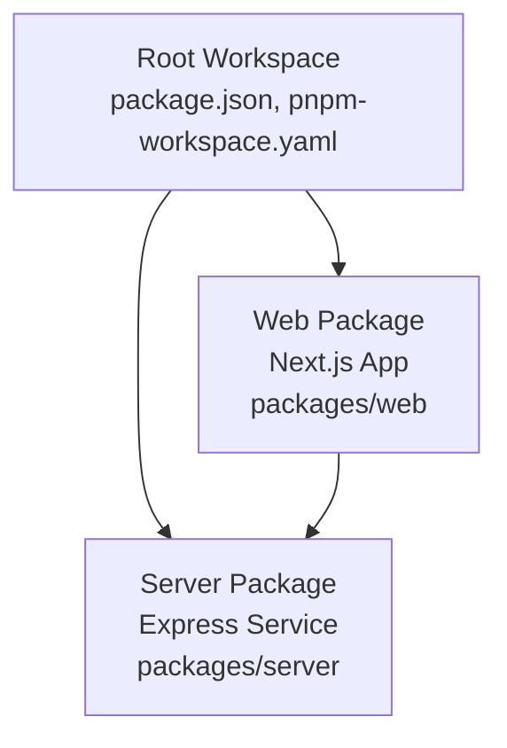
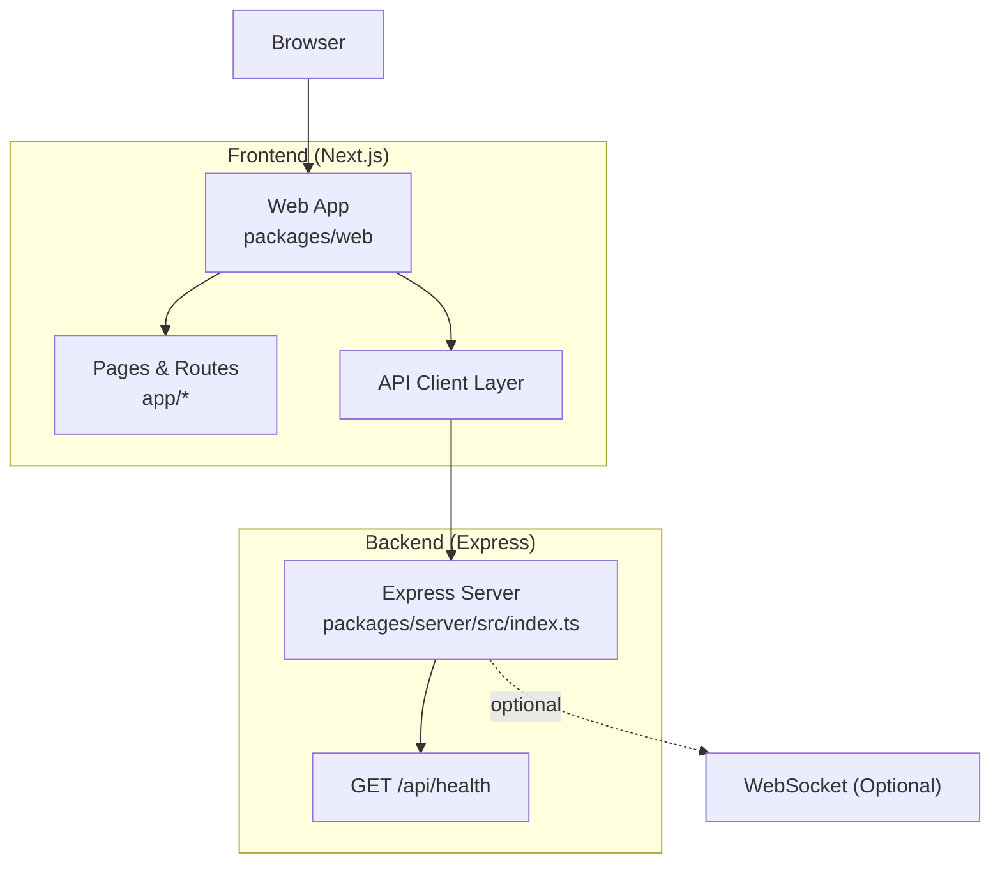
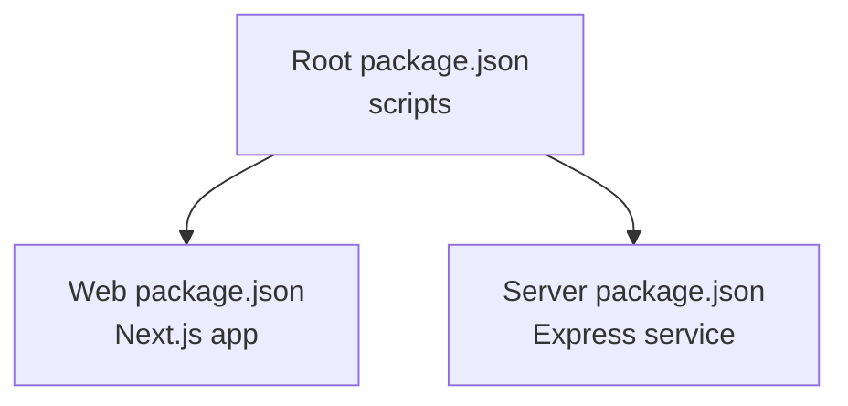

# Web Package Documentation

<cite>
**Referenced Files in This Document**
- [README.md](file://README.md)
- [package.json](file://package.json)
- [pnpm-workspace.yaml](file://pnpm-workspace.yaml)
- [packages/server/package.json](file://packages/server/package.json)
- [packages/server/src/index.ts](file://packages/server/src/index.ts)
- [packages/web/README.md](file://packages/web/README.md)
- [packages/web/AGENTS.md](file://packages/web/AGENTS.md)
- [packages/web/eslint.config.mjs](file://packages/web/eslint.config.mjs)
- [packages/web/next-env.d.ts](file://packages/web/next-env.d.ts)
- [packages/web/next.config.ts](file://packages/web/next.config.ts)
</cite>

## Table of Contents
1. [Introduction](#introduction)
2. [Project Structure](#project-structure)
3. [Core Components](#core-components)
4. [Architecture Overview](#architecture-overview)
5. [Detailed Component Analysis](#detailed-component-analysis)
6. [Dependency Analysis](#dependency-analysis)
7. [Performance Considerations](#performance-considerations)
8. [Troubleshooting Guide](#troubleshooting-guide)
9. [Conclusion](#conclusion)
10. [Appendices](#appendices)

## Introduction
This document describes the Automaton Dashboard frontend web package built with Next.js. It explains the current setup, configuration files, and the planned React component architecture for the dashboard. It also outlines the frontend's role in the broader dashboard system, recommended component organization, styling approaches, and integration patterns with the backend server. Guidance is included for extending the frontend with dashboard components, real-time data visualization, and user interaction patterns.

## Project Structure
The repository follows a monorepo layout managed by pnpm workspaces. The web package is a Next.js application located under packages/web. The server package is a TypeScript Express service under packages/server. The root package.json orchestrates development and build scripts for both packages.

**Diagram sources**
- [package.json:1-13](file://package.json#L1-L13)
- [pnpm-workspace.yaml:1-3](file://pnpm-workspace.yaml#L1-L3)

Key observations:
- The web package is a Next.js application bootstrapped with create-next-app and includes standard Next.js configuration files.
- The server package is an Express-based HTTP service with TypeScript support and basic CORS and JSON middleware.
- The root workspace script runs both server and web in development via concurrently.

**Section sources**
- [package.json:1-13](file://package.json#L1-L13)
- [pnpm-workspace.yaml:1-3](file://pnpm-workspace.yaml#L1-L3)
- [packages/web/README.md:1-37](file://packages/web/README.md#L1-L37)

## Core Components
This section documents the current configuration and scaffolding present in the web package and the foundational elements required for building the dashboard.

- Next.js configuration
  - next.config.ts defines the Next.js configuration surface for future customization.
  - next-env.d.ts integrates Next.js type definitions for the project.
  - AGENTS.md highlights version-specific constraints for Next.js usage in this project.

- ESLint configuration
  - eslint.config.mjs extends the Next.js core-web-vitals and TypeScript configurations, overriding default ignores for build artifacts.

- Getting started
  - packages/web/README.md provides standard Next.js development and deployment guidance, including local development commands and links to official documentation.

- Backend integration
  - The server exposes a health endpoint at /api/health, which can serve as a readiness probe and initial integration test for the frontend.

Recommended next steps for the web package:
- Initialize the Next.js App Router structure under packages/web/app with pages such as /dashboard, /agents, /logs, and /settings.
- Add a shared design system (tokens, components) and a consistent styling approach (CSS Modules, styled-components, or Tailwind).
- Integrate API client libraries for backend communication and implement authentication flows if required.
- Set up real-time features using WebSocket connections from the server package.

**Section sources**
- [packages/web/next.config.ts:1-8](file://packages/web/next.config.ts#L1-L8)
- [packages/web/next-env.d.ts:1-7](file://packages/web/next-env.d.ts#L1-L7)
- [packages/web/AGENTS.md:1-6](file://packages/web/AGENTS.md#L1-L6)
- [packages/web/eslint.config.mjs:1-19](file://packages/web/eslint.config.mjs#L1-L19)
- [packages/web/README.md:1-37](file://packages/web/README.md#L1-L37)
- [packages/server/src/index.ts:13-15](file://packages/server/src/index.ts#L13-L15)

## Architecture Overview
The frontend (Next.js) communicates with the backend (Express) over HTTP. The root workspace scripts coordinate development and builds for both packages. The frontend is designed to render the dashboard UI, consume backend APIs, and optionally handle real-time updates.

**Diagram sources**
- [package.json:5-8](file://package.json#L5-L8)
- [packages/server/src/index.ts:1-20](file://packages/server/src/index.ts#L1-L20)

## Detailed Component Analysis

### Next.js Configuration Surface
The Next.js configuration file provides a central place to enable advanced features such as image optimization, font optimization, experimental features, and custom webpack/babel configurations. It also serves as a hook for performance and build-time customizations.

- Purpose: Centralized Next.js configuration for the web package.
- Extensibility: Add output traces, redirects, rewrites, and performance-related settings here.

**Section sources**
- [packages/web/next.config.ts:1-8](file://packages/web/next.config.ts#L1-L8)

### Environment Type Declarations
TypeScript integration for Next.js is declared via next-env.d.ts, ensuring proper type inference for app router, images, and generated route types. This file should remain unmodified per Next.js guidance.

- Purpose: Provide Next.js runtime types to the TypeScript compiler.
- Maintenance: Do not edit this file manually; regenerate if Next.js updates its types.

**Section sources**
- [packages/web/next-env.d.ts:1-7](file://packages/web/next-env.d.ts#L1-L7)

### ESLint Configuration for Next.js
The ESLint configuration composes Next.js core-web-vitals and TypeScript presets, while overriding default ignores to include build artifacts and environment declarations. This ensures consistent linting across the monorepo.

- Purpose: Enforce code quality and Next.js best practices.
- Overrides: Ignores build outputs and environment declaration files to avoid false positives.

**Section sources**
- [packages/web/eslint.config.mjs:1-19](file://packages/web/eslint.config.mjs#L1-L19)

### Agent Rules and Version Constraints
A note warns that this Next.js version has breaking changes and different APIs/conventions compared to previous versions. This affects how components, routing, and configuration are structured.

- Purpose: Alert developers to version-specific constraints.
- Action: Review Next.js documentation for the installed version before implementing major features.

**Section sources**
- [packages/web/AGENTS.md:1-6](file://packages/web/AGENTS.md#L1-L6)

### Backend Health Endpoint
The server exposes a simple GET /api/health endpoint returning a status payload. The frontend can use this to verify connectivity and readiness during development and deployment.

- Purpose: Basic health check for backend availability.
- Usage: Call from frontend during initialization or as part of a readiness workflow.

**Section sources**
- [packages/server/src/index.ts:13-15](file://packages/server/src/index.ts#L13-L15)

## Dependency Analysis
The root workspace coordinates development and build tasks for both packages. The web package depends on Next.js and related tooling, while the server depends on Express, WebSocket, and database utilities.

**Diagram sources**
- [package.json:5-8](file://package.json#L5-L8)
- [packages/server/package.json:1-28](file://packages/server/package.json#L1-L28)

**Section sources**
- [package.json:1-13](file://package.json#L1-L13)
- [packages/server/package.json:1-28](file://packages/server/package.json#L1-L28)

## Performance Considerations
- Leverage Next.js automatic optimizations: static generation, incremental static regeneration, and image/font optimization.
- Minimize client-side JavaScript by pre-rendering pages and deferring heavy computations to the server.
- Use efficient data fetching patterns: SWR/TanStack Query for caching and background updates.
- Keep bundle sizes small by code-splitting routes and avoiding unnecessary dependencies.

## Troubleshooting Guide
Common issues and resolutions during development and integration:

- Next.js version constraints
  - Symptom: Unexpected behavior or missing APIs.
  - Resolution: Review the agent rules note and consult the Next.js documentation for the installed version.

- ESLint errors on build artifacts
  - Symptom: Lint failures for .next, out, or build folders.
  - Resolution: Confirm eslint.config.mjs overrides are applied and ignore patterns match the project structure.

- Backend connectivity
  - Symptom: Frontend cannot reach /api/health.
  - Resolution: Ensure the server is running on the expected port and CORS is enabled.

- Development server conflicts
  - Symptom: Port conflicts when running both server and web.
  - Resolution: Verify ports and adjust as needed; the root scripts run concurrently.

**Section sources**
- [packages/web/AGENTS.md:1-6](file://packages/web/AGENTS.md#L1-L6)
- [packages/web/eslint.config.mjs:8-16](file://packages/web/eslint.config.mjs#L8-L16)
- [packages/server/src/index.ts:10-11](file://packages/server/src/index.ts#L10-L11)

## Conclusion
The web package establishes a solid foundation for the Automaton Dashboard frontend using Next.js. With the current configuration files and the backend’s health endpoint, teams can begin implementing the dashboard UI, integrating with backend APIs, and adding real-time capabilities. Following the recommended component organization, styling approaches, and integration patterns will ensure a maintainable and scalable frontend architecture.

## Appendices

### Recommended Component Organization
- Feature-based structure under packages/web/app:
  - /dashboard: Main dashboard view with metrics and summaries.
  - /agents: Agent management and monitoring.
  - /logs: Log viewer and filtering.
  - /settings: Configuration and preferences.
- Shared components:
  - UI primitives (buttons, inputs, modals).
  - Layout components (header, sidebar, footer).
  - Data visualization components (charts, tables).
- Utilities:
  - API clients for backend communication.
  - Authentication helpers and guards.
  - Theme and design tokens.

### Styling Approaches
- Prefer CSS Modules or a component library with design tokens for consistency.
- Use Tailwind if rapid prototyping is desired; otherwise, scoped CSS Modules offer strong encapsulation.
- Maintain a single source of truth for colors, typography, and spacing.

### Integration Patterns with Backend
- RESTful API consumption for CRUD operations and data retrieval.
- Optional WebSocket connection for live updates (e.g., logs, metrics).
- Centralized API client with error handling and retry logic.
- Environment-aware base URLs and feature flags for development vs production.

### Real-Time Data Visualization
- Polling vs WebSocket: choose based on latency and throughput requirements.
- Visualization libraries: integrate charting libraries with SSR-friendly patterns.
- Debounce and throttle user interactions to reduce network load.

### User Interaction Patterns
- Progressive disclosure: show essential info first, expand details on demand.
- Keyboard navigation and ARIA compliance for accessibility.
- Loading states and skeleton screens for perceived performance.